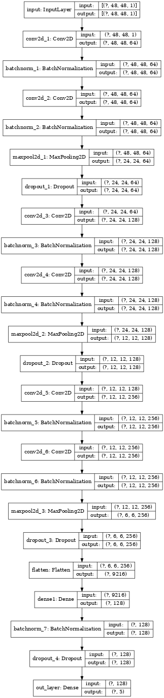
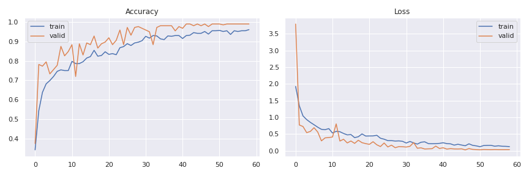
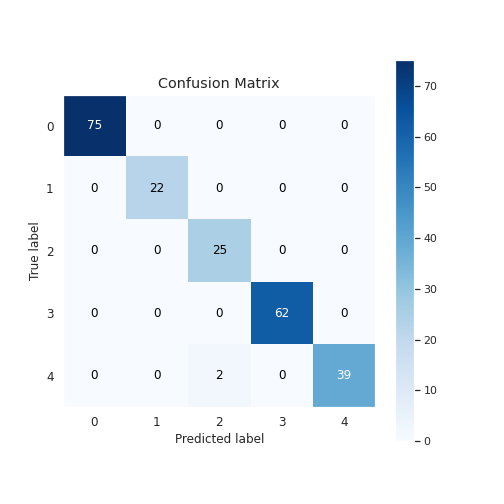

# Facial-Emotion-Recognition-CK-48

This repository contains code for a Facial Emotion Recognition (FER) system. The code provided implements a Deep Convolutional Neural Network (DCNN) for facial emotion recognition. The DCNN architecture used in this code is designed to detect and classify emotions from facial images. The dataset used here is CK+48.
## Features
- Deep Convolutional Neural Network (DCNN): The code implements a DCNN architecture specifically designed for facial emotion recognition. It uses convolutional layers, batch normalization, max pooling, and dropout to effectively extract features and classify emotions.
- Emotion Classification: The DCNN model classifies facial expressions into different emotion categories, such as happiness, sadness, anger, surprise, fear, and more.
- Model Customization: Users can modify the architecture, adjust hyperparameters, or fine-tune the model to improve performance or adapt to specific use cases.
- Training and Evaluation: The code includes the necessary functions to train the DCNN model on a dataset of labeled facial images and evaluate its performance using metrics like accuracy.
- Summary and Visualization: The code provides a summary of the DCNN model's architecture and layer-wise details.

## Architecture

## Example Outputs
Here are some example outputs generated by the Facial Emotion Recognition System:

#### Epoch History

The image above shows the training and validation accuracy and loss over epochs during model training. It provides insights into the model's learning progress and helps assess if the model is overfitting or underfitting.

#### Confusion Matrix

The confusion matrix is a visual representation of the model's performance in classifying emotions. It shows the number of correct and incorrect predictions for each emotion category. The confusion matrix helps evaluate the model's accuracy and identify any patterns or biases in the predictions.

### Issues & Suggestions
If any issues and suggestions to me, you can create an [issue](https://github.com/Siddhant-Agarwal4583/Facial-Emotion-Recognition/issues).
